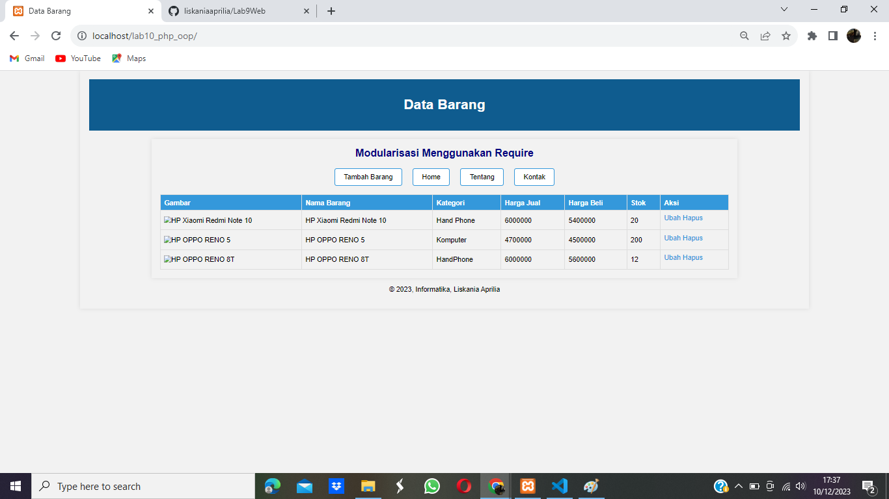
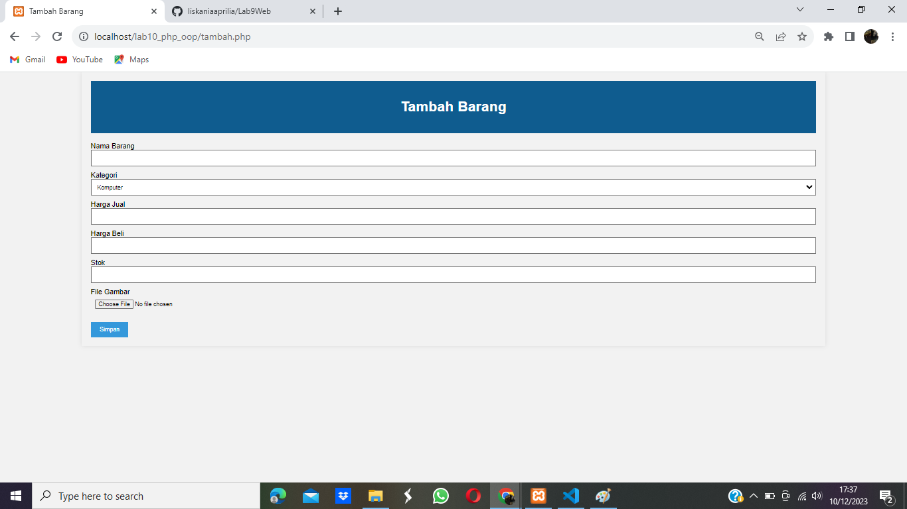
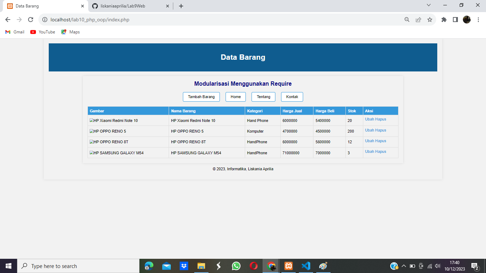
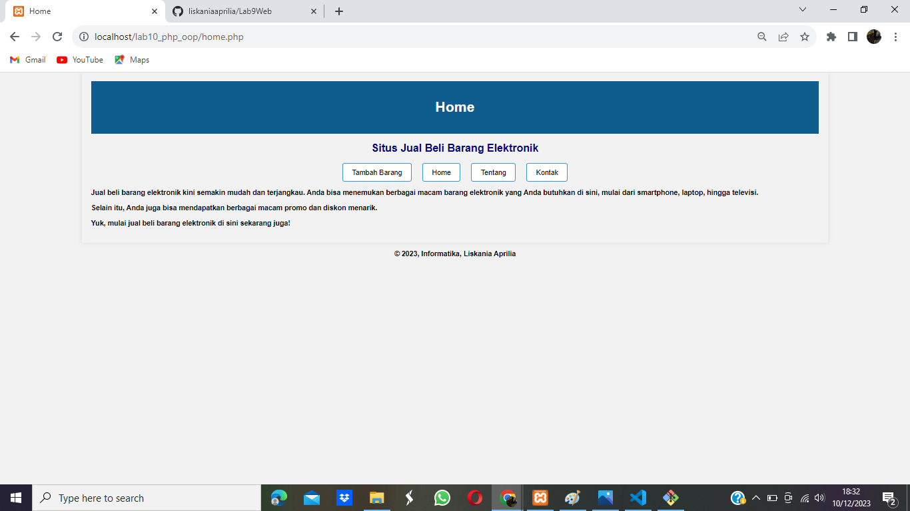
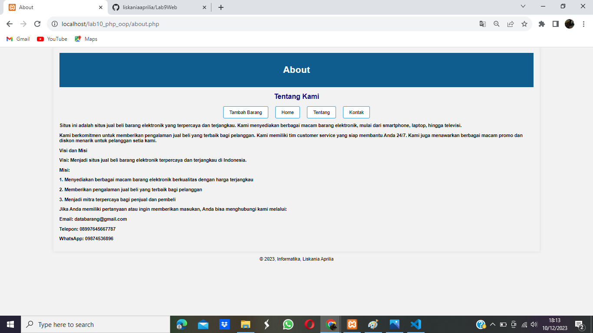
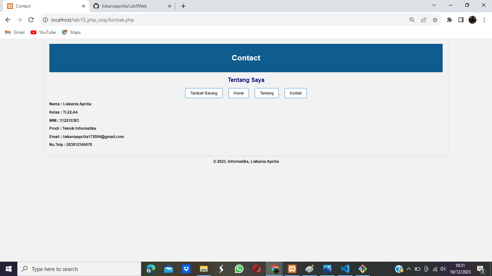
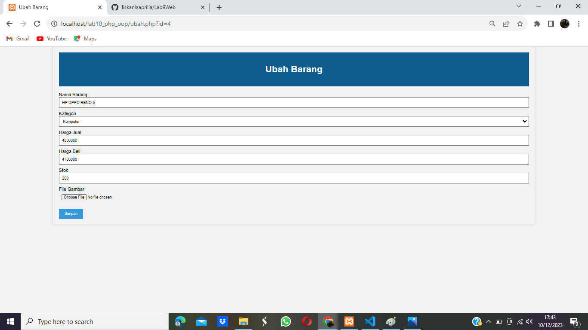
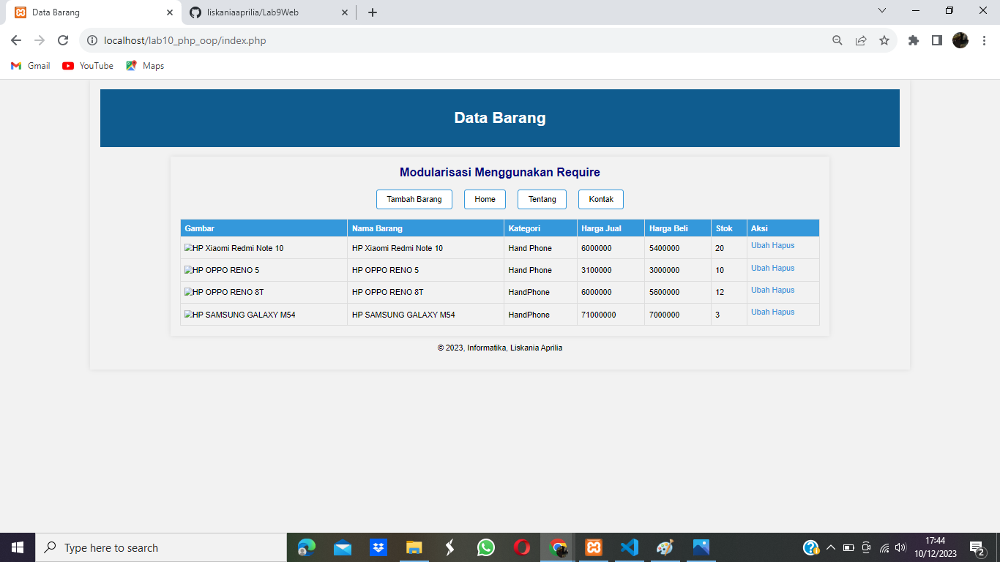
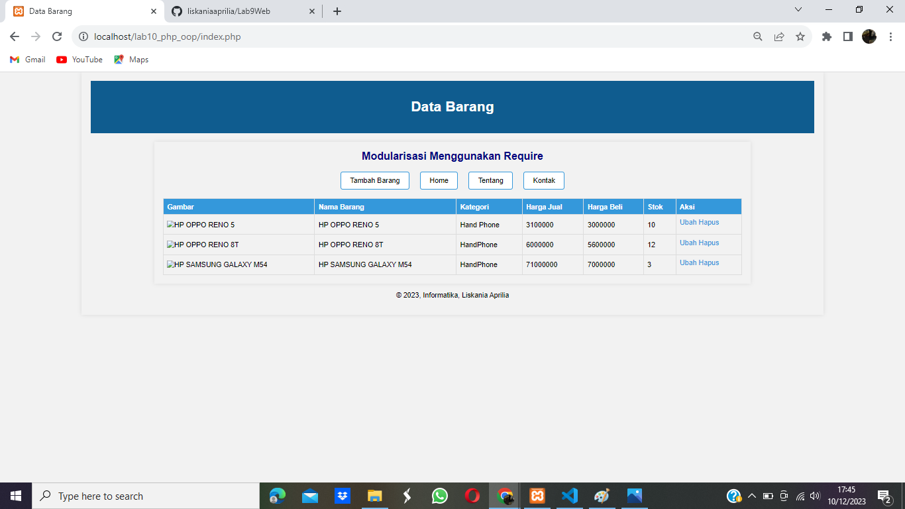

# PHP OOP

OOP (Object Oriented Programming) adalah suatu metode pemrograman yang berorientasi kepada objek. Tujuan dari OOP diciptakan adalah untuk mempermudah pengembangan program dengan cara mengikuti model yang telah ada di kehidupan sehari-hari.

## Object

Perbedaan utama OOP dengan pemrograman terstruktur (fungsional), data dan kode program tergabung menjadi satu entitas yang disebut Objek. 
- Tiap objek dapat berinteraksi satu dengan lainnya. 
- Tiap objek biasanya mewakili satu persoalan, yang memilik properti atribut dan method. 
- Properti → Data
- Method → Fungsi

## Class

Class adalah script yang digunakan sebagai cetakan untuk membuat objek Class mendefinisikan properti/atribut yang dimilik objek serta method yang dapat dilakukan oleh objek.

## Inheritance

Setiap objek harus memiliki properti dan method yang dibutuhkan. Tidak kurang, tidak lebih. Inheritance dapat memberikan properti dan method ke class-class lainnya. Misal ada 2 objek mawar, mawarPutih dan mawarMerah. 

- Keduanya memiliki beberapa informasi yang sama, tumbuh di semak-semak, berduri, harum. 
- Dengan inheritance, memungkinkan menghapus duplikasi objek.

# PRAKTIKUM - 10

1. Persiapkan text editor misalnya VSCode.
2. Buat folder baru dengan nama lab10_php_oop pada docroot webserver (htdocs)
3. Ikuti langkah-langkah praktikum yang akan dijelaskan berikutnya.

## 1. Buat file baru dengan nama mobil.php

```PHP
<?php
/**
 * Program sederhana pendefinisian class dan pemanggilan class.
 */

 class Mobil
 {
    private $warna;
    private $merk;
    private $harga;

    public function __construct()
    {
        $this->warna = "Biru";
        $this->merk = "BMW";
        $this->harga = "10000000";
    }

    public function gantiWarna ($warnaBaru)
    {
        $this->warna = $warnaBaru;
    }

    public function tampilWarna ()
    {
        echo "Warna mobilnya : ". $this->warna;
    }
 }

 // membuat objek mobil
 $a = new Mobil();
 $b = new Mobil();

 // memanggil objek
 echo "<b>Mobil pertama</b><br>";
 $a->tampilWarna();
 echo "<br>Mobil pertama ganti warna<br>";
 $a->gantiWarna("Merah");
 $a->tampilWarna();

 // memanggil objek
 echo "<br><br>Mobil pertama ganti warna</br>";
 $a->gantiWarna("Merah");
 $a->tampilWarna();

 // memanggil objek
 echo "<br><b>Mobil kedua</b><br>";
 $b->gantiWarna("Hijau");
 $b->tampilWarna();
 ?>
```

## 2. Buat file baru dengan nama form.php

```PHP
<?php
/**
 * Nama Class: Form
 * Deskripsi: Class untuk membuat form inputan text sederhana
 */

class Form
{
    private $fields = array();
    private $action;
    private $submit = "Submit Form";
    private $jumField = 0;
    public function __construct($action, $submit)
    {
        $this->action = $action;
        $this->submit = $submit;
    }
    public function displayForm()
    {
        echo "<form action='" . $this->action . "' method='POST'>";
        echo '<table width="100%" border="0">';
        for ($j = 0; $j < count($this->fields); $j++) {
            echo "<tr><td
    align='right'>" . $this->fields[$j]['label'] . "</td>";
            echo "<td><input type='text'
    name='" . $this->fields[$j]['name'] . "'></td></tr>";
        }
        echo "<tr><td colspan='2'>";
        echo "<input type='submit' value='" . $this->submit . "'></td></tr>";
        echo "</table>";
    }

    public function addField($name, $label)
    {
        $this->fields[$this->jumField]['name'] = $name;
        $this->fields[$this->jumField]['label'] = $label;
        $this->jumField++;
    }

}
?>
```

## 3. Buat file baru dengan nama form_input.php

```PHP
<?php
/**
* Program memanfaatkan Program 10.2 untuk membuat form inputan sederhana.
**/
include "form.php";
echo "<html><head><title>Mahasiswa</title></head><body>";
$form = new Form("","Input Form");
$form->addField("txtnim", "NIM");
$form->addField("txtnama", "Nama");
$form->addField("txtalamat", "Alamat");
echo "<h3>Silahkan isi form berikut ini :</h3>";
$form->displayForm();
echo "</body></html>";
?>
```

## 4. Buat file dengan nama database.php

```PHP
<?php

class Database
{
    protected $host;
    protected $user;
    protected $password;
    protected $db_name;
    protected $conn;

    public function __construct()
    {
        $this->getConfig();
        $this->conn = new mysqli($this->host, $this->user, $this->password, $this->db_name);
        if ($this->conn->connect_error) {
            die("Connection failed: " . $this->conn->connect_error);
        }
    }

    private function getConfig()
    {
        include_once("config.php");
        $this->host = $config['host'];
        $this->user = $config['username'];
        $this->password = $config['password'];
        $this->db_name = $config['db_name'];
    }
    
    public function query($sql)
    {
        return $this->conn->query($sql);
    }

    public function get($table, $where = null)
    {
        if ($where) {
            $where = " WHERE " . $where;
        }
        $sql = "SELECT * FROM " . $table . $where;
        $sql = $this->conn->query($sql);
        $sql = $sql->fetch_assoc();
        return $sql;
    }

    public function insert($table, $data)
    {
        if (is_array($data)) {
            foreach ($data as $key => $val) {
                $column[] = $key;
                $value[] = "'{$val}'";
            }
            $columns = implode(",", $column);
            $values = implode(",", $value);
        }
        $sql = "INSERT INTO " . $table . " (" . $columns . ") VALUES (" . $values . ")";
        $sql = $this->conn->query($sql);
        if ($sql == true) {
            return $sql;
        } else {
            return false;
        }
    }

    public function update($table, $data, $where)
    {
        $update_value = "";
        if (is_array($data)) {
            foreach ($data as $key => $val) {
                $update_value[] = "$key='{$val}'";
            }
            $update_value = implode(",", $update_value);
        }

        $sql = "UPDATE " . $table . " SET " . $update_value . " WHERE " . $where;
        $sql = $this->conn->query($sql);
        if ($sql == true) {
            return true;
        } else {
            return false;
        }
    }


    public function delete($table, $filter)
    {
        $sql = "DELETE FROM " . $table . " " . $filter;
        $sql = $this->conn->query($sql);
        if ($sql == true) {
            return true;
        } else {
            return false;
        }
    }
}
?>
```

# PERTANYAAN & TUGAS

Implementasikan konsep modularisasi pada kode program pada praktukum sebelumnya dengan menggunakan class library untuk form dan database connection.

## 1. Membuat file untuk menampilkan data (Read)



## 2. Menambah Data (Create)





## 3. Menampilkan Bagian Home



## 4. Menampilkan Bagian Tentang



## 5. Menampilkan Bagian Kontak



## 6. Mengubah Data (Update)





## 7. Menghapus Data (Delete)



# FINISH